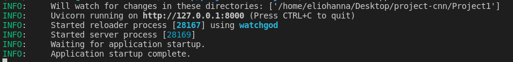
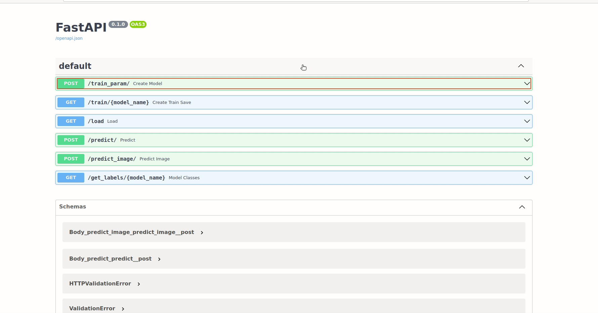
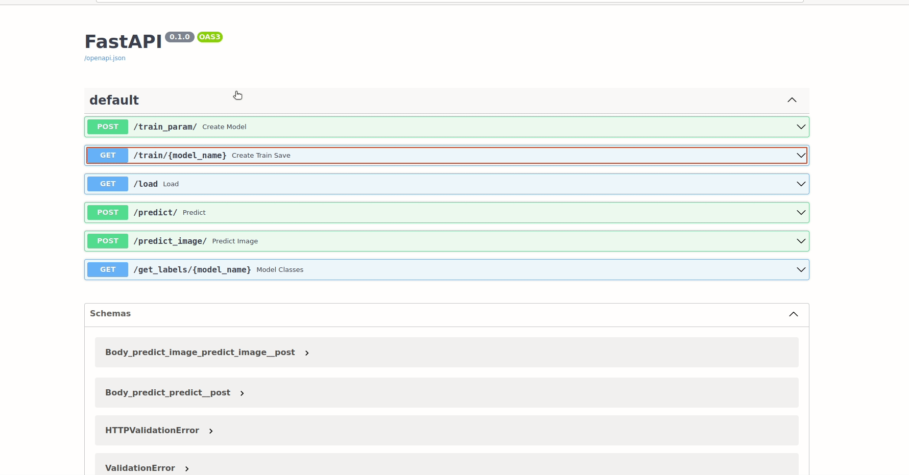
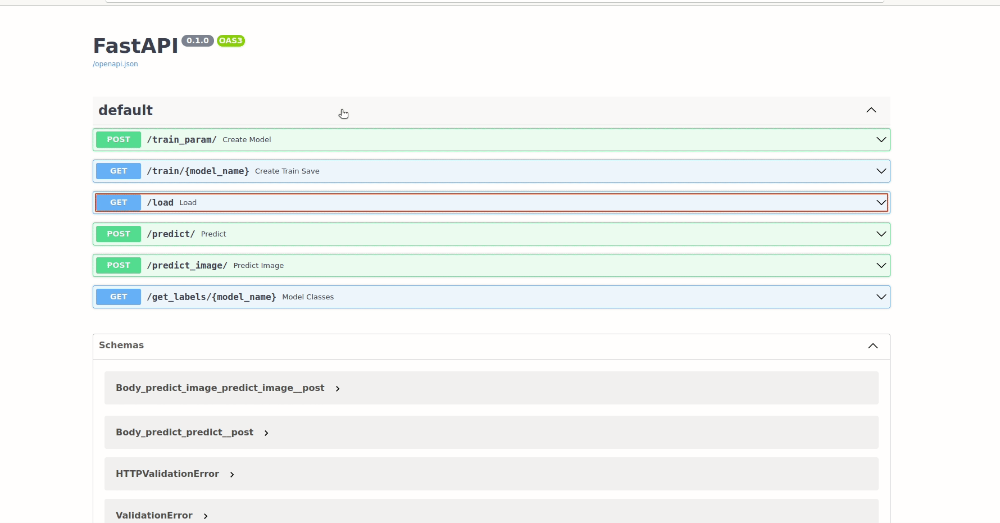
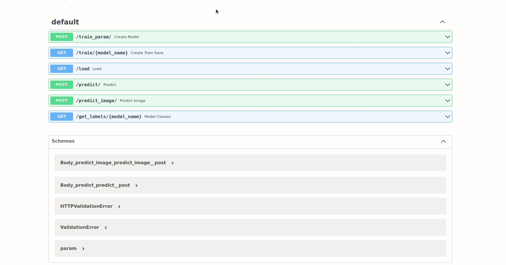
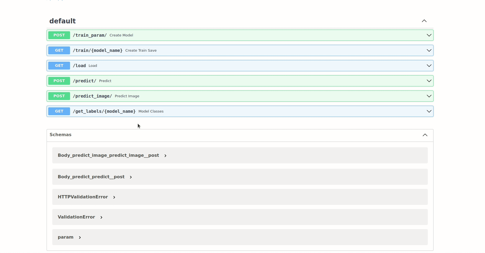
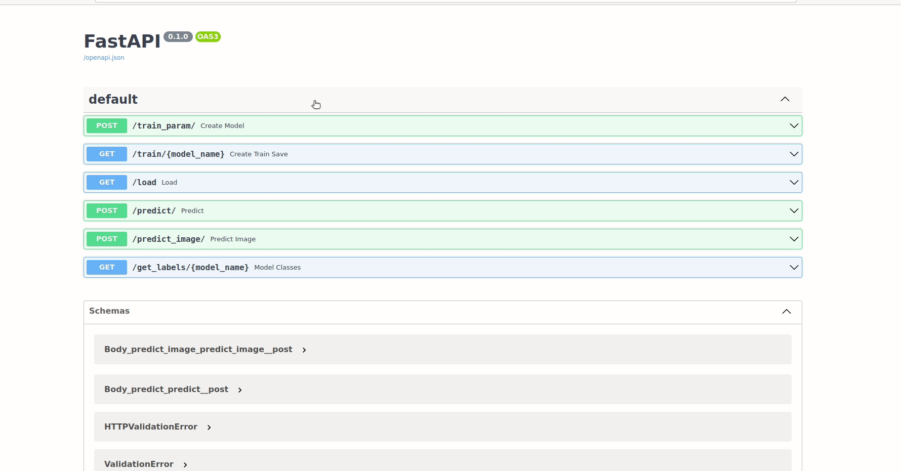

# CNN_Training_Inference_Classification_API

This is a repository for basic CNN classification training and inference API using the tensorflow keras and CIFAR-10 Dataset. It's supported on both Windows and Linux Operating systems.


# Build_the_API


## Prerequisites 


- Ubuntu 18.04
- Docker CE latest stable release


#### How to check for prerequisites

**To check if you have docker-ce installed:** 

​		    	      `docker --version`


## Build the Solution

To build the solution, run the following command from the repository's root directory

```sh
docker build -t <name> -f Docker/dockerfile .
```

## Run the Solution

To run the solution, run the following command from the repository's root directory

```sh
docker run -it -v $(pwd)/assets:/main/assets -p <port>:8000 <same_name_as_the_build> 
```

After a successful run you should see something like the following:




## Usage

- If the app is deployed on your machine:  
  * open your web browser and type the following: `localhost:<port>` or `127.0.0.1:<port>  ` for the API

- If the app is deployed on a different machine: open your web browser and type the following: `<machine_ip>:<port>`


### Endpoints summary

## Training_API

#### /train_param (POST)

Train a new model and pass the parameters using a json format object then save it



#### /train/{model_name} (POST)

Train a new model and give only the model name as parameter then save it




## Inference_API

#### /load (GET)

Loads all available models.



#### /predict (POST)

Predict using a specific model and a specific image and return a string "prediction".


#### /predict_image (POST)

Predict using a specific model and a specific image and return an image where the prediction is written on it.



#### /get_labels/{model_name} (GET)

return all the labels from a specific model.



## Acknowledgements

[Elio Hanna](https://github.com/Elio-hanna)
